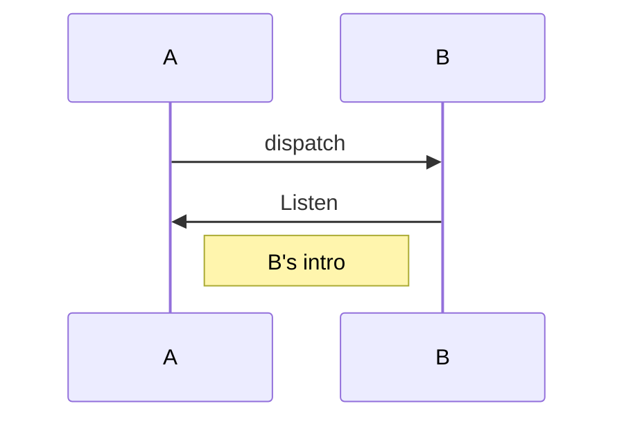

[TOC]
# 目录
## 序列图
* grammar_mermaid: true


## 序列图2
* grammar_sequence: true
```sequence
A->B: dispatch
B->A: Listen
Note right of A: A's intro
```
## 流程图
* grammar_flow: true
* ***不要有空格
* 连接end的条件最好是yes(好看一点) 
* Key
	* start
	* operation
	* condition
	* end
* 操作 
	* UserOperation=>Key: View
		* UserOperation:用户自定义名称
		* Key : start/operation/condition/end
		* View:显示内容
* 条件
	* 定义
		* UserCondition->condition: View
	* 条件判断
		* UserCondition(yes)->UserOperation
		* UserCondition(no)->UserOperation
* 流程
	* 例1
		* st->op1->op2->op3->e
	* 例2
		* cond1如果是yes则结束, 否则返回开始
		* st->op1->cond1
		* cond1(yes)->e
		* cond1(no)->st
```flow
st=>start: 开始(st是自定义名字)
e=>end: 结束(e是自定义名字)
someStep=>operation: 操作(someStep是自定义名字)
cond=>condition: 条件 是否继续OOXX
st->someStep->cond
cond(no)->someStep
cond(yes)->e
```

## 图片


## 语法块
```java
public function xx() : void {
	trace(abc);
}
```
## 语句
* ~~删除语句~~


