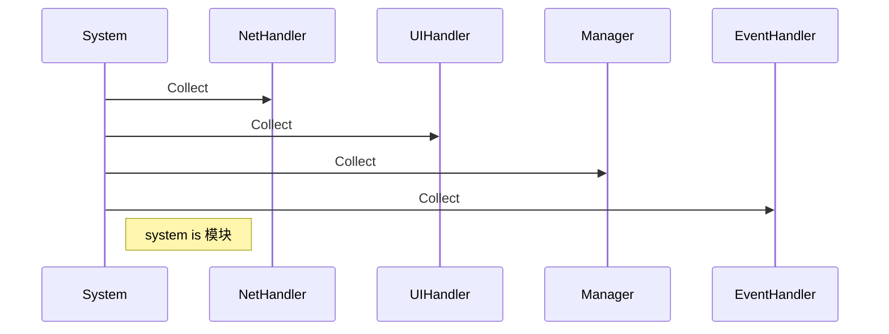
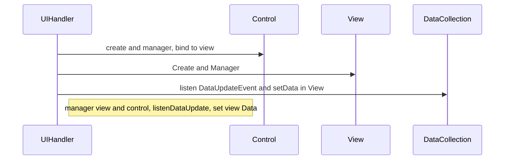
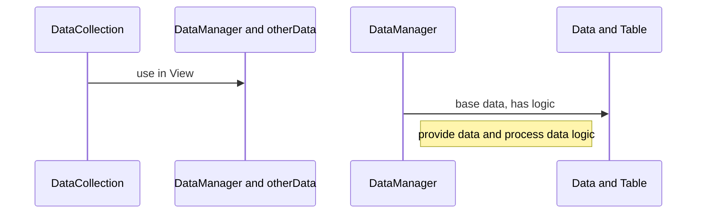
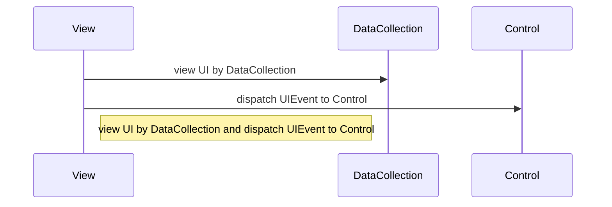
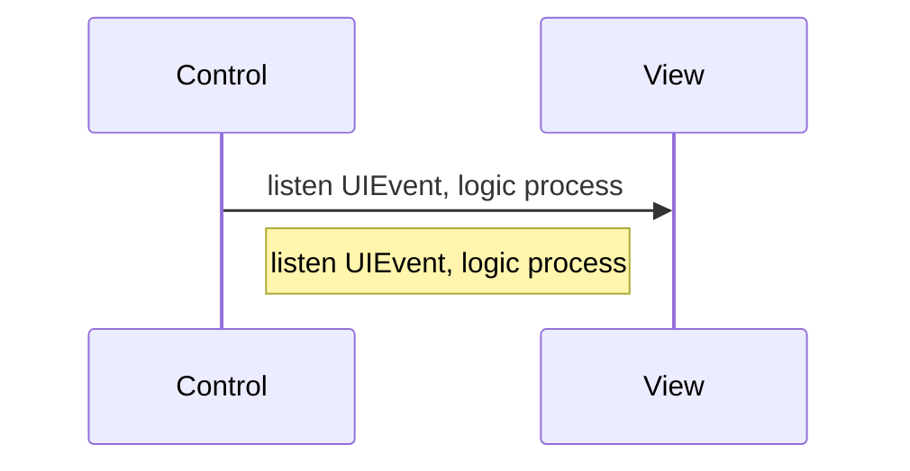
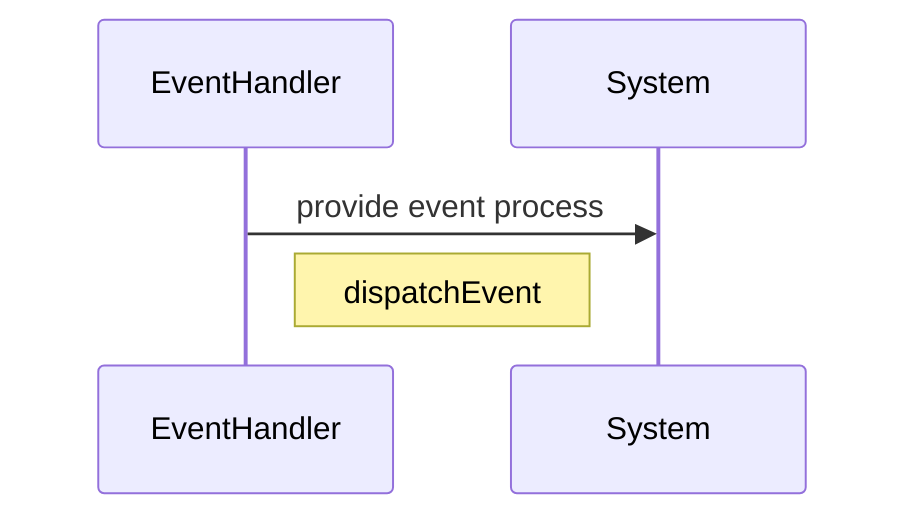
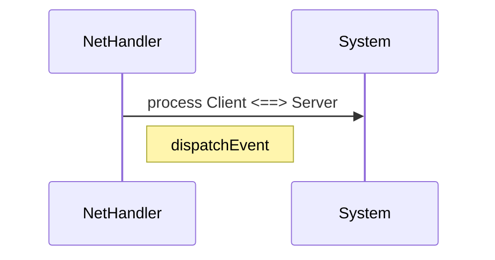
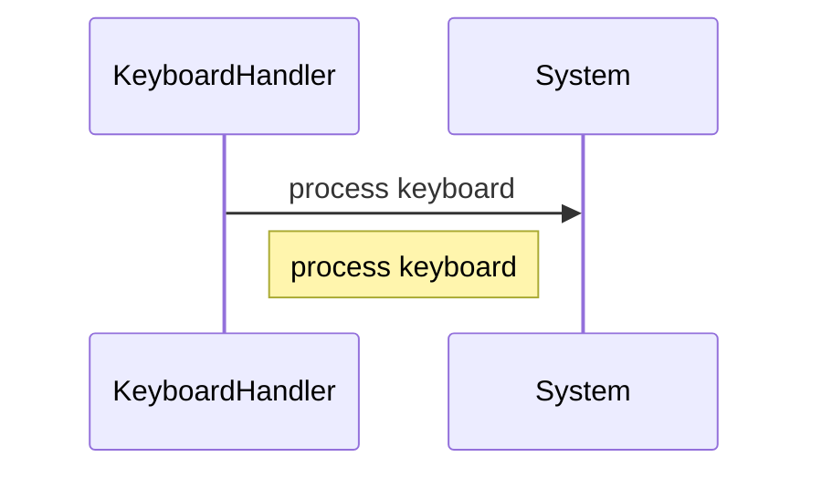

---
title: 2016-11-7 结构
grammar_cjkRuby: true
grammar_mermaid: true
---
[TOC]

# 系统结构
## System

## UIHandler(MVC)

### Data(M)

### View结构(V)

### Control(C)

## EventHandler

## NetHandler

## KeyboardHandler

# System
* system
	* interface
		* ShowView
		* HideView
		* Enter
		* Exit
		* ListenEvent
		* UnlistenEvent
	* event
		* dispatchEvent
		* listenEvent
		* unlistenEvent
	* manager : system logic process
	* NetHandler: client <==> server
	* uiHandler : manager view
	* EventHandler : listen and dispatch event 
	* dataManager : store data and table, process data logic
	* visit interface by other system only. 
	
# Class
* UI
	* UIHandler : ViewManagerHandler
	* View
		* RootView : ViewBase implements IWindow
		* ChildView : ViewBase implements IWindow
	* ViewEvent : Event
	* Control : ControlBase
	* ViewComponent
		* IUIComponentMap : CUIComponentBase
		* Component : CUIComponentBase implements IUIComponentBase
		* UIEffectHandler implements IUIEffectHandler
* NetWorker
	* NetHandler :SystemHandler
* Logic
	* Manager : AbstractHandler
* Event
	* EventHandler : AbstractHandler
* Data
	* DataManager
	* Table
	* ObjectData
	* DataCollection

## End
